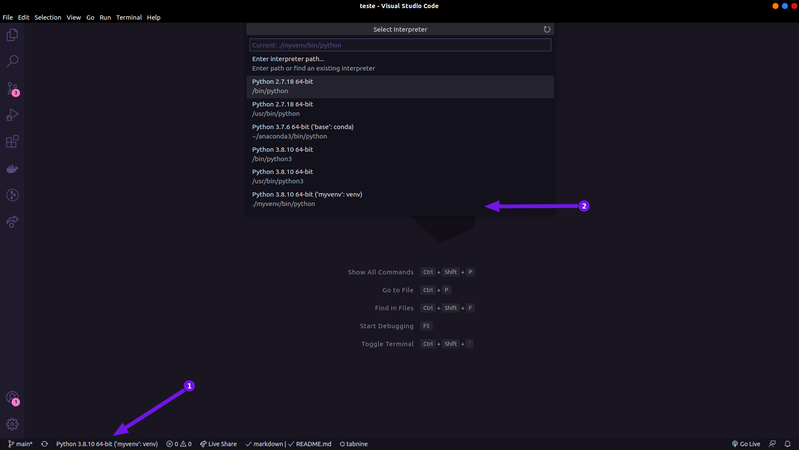

# Algorítimo de lógica Fuzzy

# :page_with_curl: Índice

* [Sobre o projeto](#interrobang-sobre-o-projeto)
  - [Tecnologias utilizadas](#-tecnologias-utilizadas)
* [Executando a aplicação](#rocket-executando-a-aplicação)
* [Para contribuir](#mailbox-para-contribuir)
  - [Histórico de atualizações](#clock10-histórico-de-atualizações)

# :interrobang: Sobre o projeto

Esse é um algorítimo de lógica fuzzy desenvolvido através da disciplina de Tópicos de Inteligência Artificial ministrada pelo Prof. Dr. [Virgílio de Melo Langoni](http://buscatextual.cnpq.br/buscatextual/visualizacv.do;jsessionid=960683E50343F9D09B9E526B19CF587D.buscatextual_0), do curso de engenharia [elétrica da UFTM](http://www.uftm.edu.br/engenharia-eletrica).

Na qual busca capacitar o aluno a compreender e utilizar os conceitos e técnicas das principais ferramentas de Inteligência Artificial em aplicações das diversas áreas da Engenharia Elétrica. Abordando temas como estado da arte da Inteligência Artificial, empregar recursos da Lógica e Manipulação Simbólica, compreender os conceitos fundamentais de [Redes Neurais Artificiais](), compreender os conceitos fundamentais de **Lógica Fuzzy**. Compreender os conceitos fundamentais de [Algoritmos Genéticos]() e compreender qual técnica de Inteligência Artificial é mais adequada para se aplicar em determinados problemas.

Para saber mais sobre lógica Fuzzy basta clicar [aqui](). (Artigo ainda em produção...)

## 🧑‍💻 Tecnologias utilizadas

- [Python 3](https://www.python.org/)

# :rocket: Executando a aplicação

Esse projeto foi realizado no [Visual Studio Code](https://code.visualstudio.com/), portanto o passo a passo abaixo será na mesma ferramenta. Caso não utilize o VS Code basta copiar todos os componentes em sua IDE ou editor de preferência.

A parte principal do algorítmo foi criada em um notebook do Jupyter devido a melhor apresentação em forma de bloco. porém as classes utilizadas foram implementadas em ambiente virtual Python.

Primeiramente é necessário ter o Python 3 instalado em seu computador, após abra seu terminal é clone o repositório utilizando:

    git git@github.com:PedroHenry-Santos/Logica_Fuzzy.git.

Abra o projeto no VS Code e crie o ambiente virtual do Python 3:

> Caso não tenha o **virtualenv** instalado no seu python basta antes digitar o seguinte código `pip3 install virtualenv`.

 

    python -m venv [nome que desejar] - (Windows)

ou

    python3 -m venv [nome que desejar] - (Linux)

Após instalar basta selecione o Python do **venv** no local da imagem abaixo.

  

No terminal do VSCode instale as bibliotecas [numpy](https://numpy.org/install/) e [matplotlib](https://matplotlib.org/stable/users/installing.html). A o arquivo **main.ipynb** e executar todos os blocos.

# :mailbox: Para contribuir

Caso queira ajudar a implementar novas funcionalidade nessa aplicação, poderá seguir o **roteiro de funcionalidades** a seguir. Ou também poderá propor sua própria funcionalidade.  
Para isso basta seguir o [roteiro](https://github.com/PedroHenry-Santos/Logica_Fuzzy/blob/main/CONTRIBUTING.md) em CONTRIBUTING.

## :heavy_check_mark: Roteiro de funcionalidade da aplicação

Para um acompanhamento mais atualizado verifique a aba [Projeto](https://github.com/PedroHenry-Santos/Logica_Fuzzy/projects/1).

- [x] Algoritimo de lógica Fuzzy para o problema específico.
- [ ] Desacoplar o algotimo para problemas variados.

## :clock10: Histórico de atualizações

Para saber sobre as [versões](https://github.com/PedroHenry-Santos/Logica_Fuzzy/releases) deste código consulte o CHANGELOG detalhado.

# :lock: Licença

[MIT License](https://github.com/PedroHenry-Santos/Logica_Fuzzy/blob/main/LICENCE.md) ® [Pedro Santos](https://github.com/PedroHenry-Santos)
